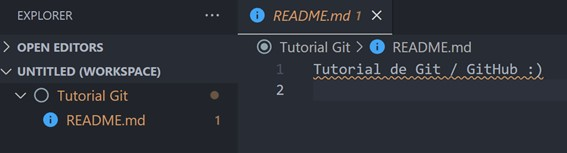
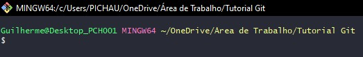

# Tutorial prático de Git Bash e GitHub

## Primeiramente, para que serve o Git e GitHub?

Git é um sistema de controle de versão distribuído que ajuda você (e demais pessoas envolvidas em um projeto) a acompanhar as alterações em seu código ao longo do tempo. GitHub é uma plataforma baseada na web que fornece hospedagem para repositórios Git, tornando mais fácil para você armazenar, gerenciar e colaborar em seu código.

A importância do Git e do GitHub é que eles fornecem uma forma fácil e eficiente de gerenciar e colaborar em projetos de software. Com o Git, você pode manter o histórico de todas as alterações feitas no seu código e reverter facilmente as alterações indesejadas. O GitHub permite que você armazene seus projetos na nuvem, o que significa que é possível acessá-los de qualquer lugar e compartilhá-los com outros desenvolvedores. Além disso, o GitHub oferece uma ampla comunidade de desenvolvedores que você pode colaborar e aprender, quase como uma rede social propriamente dita.

---

## Índice de assuntos

### &nbsp;&nbsp;&nbsp; [I. Instalando o Git Bash](#1-instalando-o-git-bash)

### &nbsp;&nbsp;&nbsp; [II. Criando um repositório local (Computador)](#2-criando-um-repositório-local-computador)

### &nbsp;&nbsp;&nbsp; [III. Criando um repositório remoto (GitHub)](#3-criando-um-repositório-remoto-github)

### &nbsp;&nbsp;&nbsp; [IV. Interligando repositório remoto (GitHub) ao local (Computador)](#4-interligando-repositório-remoto-github-ao-local-computador)

### &nbsp;&nbsp;&nbsp; [V. Realizando o primeiro push dos seus arquivos para o repositório](#5-realizando-o-primeiro-push-dos-seus-arquivos-para-o-repositório)

---

## 1. Instalando o Git Bash

O primeiro passo do tutorial é baixar o Git Bash, caso você ainda não o tenha em seu computador. O link para download pode ser acessado em [Git SCM](https://git-scm.com/downloads).

Após download, basta seguir o fluxo normal de instalação até que ela seja finalizada.

## 2. Criando um repositório local (Computador)

1. Crie uma nova pasta no seu computador para utilizarmos nesse tutorial. Para fins de exemplificação, vou usar como nome `Tutorial Git`, mas sinta-se a vontade de usar o nome que preferir.

2. Com o Visual Studio Code (VS Code) aberto, clique em `Open Folder...` para abrir a pasta que acabamos de criar.

   - Caso você não tenha o VS Code instalado, o download pode ser feito em seu [site oficial](https://code.visualstudio.com/download).

        

3. Vamos criar um arquivo `README.md` em nossa pasta. Esse arquivo será utilizado apenas como referência que no tutorial, mas a mesma sequência se aplicaria para quaisquer arquivos que você criasse em sua pasta (.html, .js, .json, etc). Vamos colocar algum texto em nosso `README.md`, apenas para ele não ficar vazio.

4. Vá até a pasta que você cruiou no item 1., e, clicando com botão direito dentro dela, clique em `Git Bash Here`, isso fará com que o terminal do Git seja aberto.

   

   - Uma janela semelhante a essa será aberta:

       

5. A primeira coisa que precisamos fazer ao usar o Git pela primeira vez é configurar nosso `user name` e `e-mail`. Para isso vamos usar os seguintes códigos (um de cada vez):

   - `git config --global user.name <usuario>` -> Exemplo prático: `git config --global user.name "João Bicicleta"`.

   - `git config --global user.email <email>` -> Exemplo prático: `git config --global user.email joao.bicicleta@email.com"`.

   - Note que o terminal não irá apresentar nenhuma informação depois que inserimos esses dois códigos. Esse é um comportamento esperado, ele só irá retornar algo em caso de erro.

6. Para "inicializar" nosso repositório local, nós vamos usar o comando `git init`. Dessa vez, note que houve três alterações que podemos observar:

   - O terminos nos informou `Initialized empty Git repository in C:...`. O que significa que nossa pasta agora é um repositório local.

   - Note que ao lado do caminho da nossa pasta, agora é apresentado o termo `(master)`. Voltarei a comentar disso em um tópico mais adiante.

       

   - Uma pasta oculta `.git` foi criada em nosso repositório. Caso você não esteja vendo esta pasta, é porque sua visualização de pastas ocultas está desativada.

       

## 3. Criando um repositório remoto (GitHub)

1. Acesse a sua conta do GitHub, caso você não tenha, ela pode ser criada [clicando aqui](https://github.com/).

2. Em seu perfil, acesse a aba de repositórios e clique em `New` para criar um novo repositório.

3. Vou nomear o repositório como `Tutorial Git`, assim como a pasta que criei anteriormente. Isso não é obrigatório, apenas estou adotando para seguir um padrão. As demais configurações do repositório podem permanescer como estão.

4. Pronto, nosso repositório remoto foi criado! O próximo passo é fazer a interligação entre ele e nosso repositório local, criado no [Tópico 2](#2-criando-um-repositório-local-computador).

## 4. Interligando repositório remoto (GitHub) ao local (Computador)

1. Primeiramente, vamos trocar o nome da nossa branch (ramificação) de `master` para `main`. Pois grande parte do mercado adota a nomeclatura de `main`, de forma que sua utilização é boa prática. Para isso, vamos utilizar o seguinte código:

   - `git branch -M <nome da branch>` -> Exemplo prático: `git branch -M "main"`.

2. Para fazer um commit, ou seja, primeiro precisamos retira-los do nosso diretório de trabalho e "prepara-los" para serem commitados (staging area). Para isso, usaremos o seguinte código:

   - `git add <arquivo>` -> Exemplo prático: `git add README.md`.

   - Como o único arquivo que nós temos no repositório é o README.md, podemos especificar ele em nossa linha de código conforme mostrado acima. Caso você tenha vários arquivos, e queira adicionar a todos, você vai utilizar, no lugar do nome do arquivo um ponto final, ficando assim o código: `git add .`.

3. Feito isso, nossos arquivos estão prontos para serem commitados. Para fazer isso, usaremos o código `git commit -m <mensagem>`, sendo que na área de mensagem, vamos inserir a descrição do que estamos commitando. Ou seja, quais alterações fizemos no arquivo, por exemplo `git commit -m "Primeiro commit"`.

Seus arquivos foram commitados, agora, vamos estabelecer o link entre nosso repositório local com o remoto, de modo que os itens de seu computador sejam "transferidos" para o seu GitHub.

4. Para isso, vamos usar o código `git remote add origin <link do repositório>`. O link do repositório pode ser obtido ao clicar no botão de `<> Code` do GitHub, conforme indicado abaixo.

   

   - O exemplo de uso na prática ficaria assim: `git remote add origin https://github.com/guilhermelcosta/Tutorial-Git.git`.

Quase pronto! Seus repositórios já estão interligados, o que falta agora é apenas "transferir" os arquivos locais para o repositório remoto, usando o comando `push`.

## 5. Realizando o primeiro push dos seus arquivos para o repositório

Insira no terminal a seguinte linha de código: `git push -u origin main`. O que esse comando quer dizer é que estamos dando um push de arquivos da nossa branch `main` na nossa `origin` (GitHub).

Pronto, apenas! Feito isso, basta recarregar seu navegador, que os arquivos já estarão sincronizados.
