# Tutorial prático de Git Bash e GitHub 🔥

## Primeiramente, para que serve o Git e GitHub?

Git é um sistema de controle de versão distribuído que ajuda você (e demais pessoas envolvidas em um projeto) a acompanhar as alterações em seu código ao longo do tempo. GitHub é uma plataforma baseada na web que fornece hospedagem para repositórios Git, tornando mais fácil para você armazenar, gerenciar e colaborar em seu código.

A importância do Git e do GitHub é que eles fornecem uma forma fácil e eficiente de gerenciar e colaborar em projetos de software. Com o Git, você pode manter o histórico de todas as alterações feitas no seu código e reverter facilmente as alterações indesejadas. O GitHub permite que você armazene seus projetos na nuvem, o que significa que é possível acessá-los de qualquer lugar e compartilhá-los com outros desenvolvedores. Além disso, o GitHub oferece uma ampla comunidade de desenvolvedores que você pode colaborar e aprender, quase como uma rede social propriamente dita.

---

## Índice de assuntos

### &nbsp;&nbsp;&nbsp; [I - Instalando o Git Bash](#i-instalando-o-git-bash)

### &nbsp;&nbsp;&nbsp; [II - Push do computador para o GitHub](#ii-push-do-computador-para-o-github)

### &nbsp;&nbsp;&nbsp;&nbsp;&nbsp;&nbsp; [_II.1 - Criando um repositório local_](#ii1-criando-um-repositório-local)

### &nbsp;&nbsp;&nbsp;&nbsp;&nbsp;&nbsp; [_II.2 - Criando um repositório remoto_](#ii2-criando-um-repositório-remoto)

### &nbsp;&nbsp;&nbsp;&nbsp;&nbsp;&nbsp; [_II.3 - Interligando repositório remoto ao local_](#ii3-interligando-o-seu-repositório-remoto-ao-local)

### &nbsp;&nbsp;&nbsp;&nbsp;&nbsp;&nbsp; [_II.4 - Realizando o primeiro push dos seus arquivos para o repositório_](#ii4-realizando-o-primeiro-push-dos-seus-arquivos-para-o-repositório)

### &nbsp;&nbsp;&nbsp; [III - Pull do GitHub para o computador](#iii-pull-do-github-para-o-computador)

### &nbsp;&nbsp;&nbsp;&nbsp;&nbsp;&nbsp; [_III.1 - Realizar fetch dos arquivos remotos_](#iii1-realizar-fetch-dos-arquivos-remotos)

### &nbsp;&nbsp;&nbsp;&nbsp;&nbsp;&nbsp; [_III.2 - Comparando o arquivo local com o remoto_](#iii2-comparando-o-arquivo-local-com-o-remoto)

### &nbsp;&nbsp;&nbsp;&nbsp;&nbsp;&nbsp; [_III.3 - Baixando os arquivos remotos para o repositório local_](#iii3-baixando-os-arquivos-remotos-para-o-repositório-local)

### &nbsp;&nbsp;&nbsp; [IV - Criação de diferentes branchs](#iv-criação-de-diferentes-branchs)

### &nbsp;&nbsp;&nbsp;&nbsp;&nbsp;&nbsp; [_IV.1 - Alterar entre branchs diferentes_](#iv1-alterar-entre-branchs-diferentes)

### &nbsp;&nbsp;&nbsp;&nbsp;&nbsp;&nbsp; [_IV.2 - Interface GitHub para visualização de branchs_](#iv2-interface-github-para-visualização-de-branchs)

### &nbsp;&nbsp;&nbsp; [V - Unir conteúdo de duas branchs diferentes](#v-unir-conteúdo-de-duas-branchs-diferentes)

### &nbsp;&nbsp;&nbsp; [VI - Clonando um repositório remoto para o seu computador](#vi-clonando-um-repositório-remoto-para-o-seu-computador)

### &nbsp;&nbsp;&nbsp; [VII - Fechamento e lista de comandos Git](#vii-fechamento)

---

## I. Instalando o Git Bash

O primeiro passo do tutorial é baixar o Git Bash, caso você ainda não o tenha em seu computador. O link para download pode ser acessado em [Git SCM](https://git-scm.com/downloads).

Após finalizar o download, basta seguir o fluxo normal de instalação até que ele seja finalizado.

## II. Push do computador para o GitHub

Nessa sessão, vou mostrar como você pode criar um repositório local em seu computador, e o interligar ao seu repositório remoto. Por fim, você verá como "transferir" os arquivos do seu repositório local para o remoto por meio do comando `push`.

### _II.1 Criando um repositório local_

1. Crie uma nova pasta no seu computador para utilizarmos nesse tutorial. Para fins de exemplificação, vou usar como nome `Tutorial Git`, mas sinta-se a vontade para usar o nome que preferir.

2. Com o Visual Studio Code (VS Code) aberto, clique em `Open Folder...` para abrir a pasta que acabamos de criar.

   - Caso você não tenha o VS Code instalado, o download pode ser feito em seu [site oficial](https://code.visualstudio.com/download).

        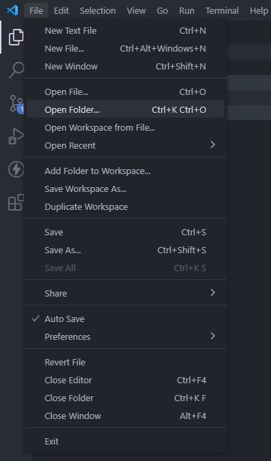

3. Vamos criar um arquivo `README.md` em nossa pasta. Esse arquivo será utilizado apenas como referência no tutorial, mas a mesma sequência de passos se aplicaria para quaisquer arquivos que você criasse em sua pasta (.html, .js, .json, etc). Vou colocar algum texto em nosso `README.md`, apenas para ele não ficar vazio.

   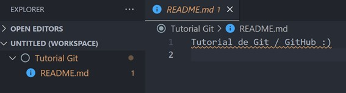

4. Vá até a pasta que você criou no item 1, e, clicando com botão direito dentro dela, clique em `Git Bash Here`, isso fará com que o terminal do Git Bash seja aberto.

   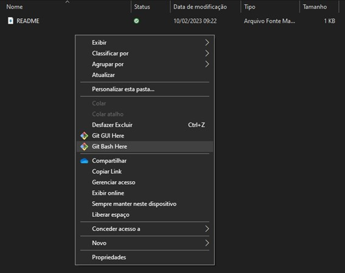

   - Uma janela semelhante a essa será aberta:

       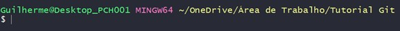

5. A primeira coisa que precisamos fazer ao usar o Git Bash pela primeira vez é configurar nosso `user name` e `e-mail`. Para isso vamos usar os seguintes códigos (um de cada vez):

   - `git config --global user.name <usuario>` &rarr; Exemplo prático: `git config --global user.name "James Manteiguinha"`.

   - `git config --global user.email <email>` &rarr; Exemplo prático: `git config --global user.email "james.manteiguinha@email.com"`.

   - Note que o terminal não irá apresentar nenhuma informação depois que inserirmos esses dois códigos. Esse é um comportamento esperado, ele só irá retornar algo em caso de erro.

6. Para "inicializar" nosso repositório local, nós vamos usar o comando `git init`. Dessa vez, houve três alterações que podemos observar:

   - O terminos nos informou `Initialized empty Git repository in C:/...`. O que significa que nossa pasta agora é um repositório local.

   - Note que ao lado do caminho da nossa pasta no Git Bash, agora é apresentado o termo `(master)`. Voltarei a comentar disso em um tópico mais adiante.

        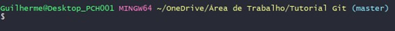

   - Uma pasta oculta `.git` foi criada em nosso repositório. Caso você não esteja vendo esta pasta, é porque sua visualização de pastas ocultas está desativada.

        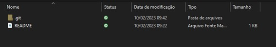

### _II.2 Criando um repositório remoto_

1. Acesse a sua conta do GitHub, caso você não tenha, ela pode ser criada no site oficial do [GitHub](https://github.com/).

2. Em seu perfil, acesse a aba de repositórios e clique em `New` para criar um novo repositório.


3. Vou nomear o repositório como `Tutorial Git`, assim como a pasta que criei anteriormente. Isso não é obrigatório, apenas estou adotando para seguir um padrão. As demais configurações do repositório podem permanescer como estão.

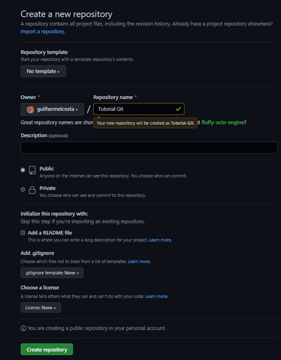

4. Pronto, nosso repositório remoto foi criado! O próximo passo é fazer a interligação entre ele e nosso repositório local, criado no [item II.1](#ii1-criando-um-repositório-local).

### _II.3 Interligando o seu repositório remoto ao local_

1. Primeiramente, vamos trocar o nome da nossa branch (ramo) de `master` para `main`, pois grande parte do mercado atualmente adota a nomeclatura de `main`, de forma que sua utilização é boa prática. Para isso, vamos utilizar o seguinte código:

   - `git branch -M <nome da branch>` &rarr; Exemplo prático: `git branch -M "main"`.

2. Para fazer um commit, ou seja, primeiro precisamos retira-los do nosso diretório de trabalho e "prepara-los" para serem commitados (staging area). Para isso, usaremos o seguinte código:

   - `git add <arquivo>` &rarr; Exemplo prático: `git add README.md`.

   - Como o único arquivo que nós temos no repositório é o `README.md`, podemos especificar ele em nossa linha de código conforme mostrado acima. Caso você tenha vários arquivos, e queira adicionar a todos, você vai utilizar, no lugar do nome do arquivo um ponto final, ficando assim o código: `git add .`.

3. Feito isso, nossos arquivos estão prontos para serem commitados. Para fazer isso, usaremos o código `git commit -m <mensagem>`, sendo que na área de mensagem, vamos inserir a descrição do que estamos commitando. Ou seja, quais alterações fizemos no arquivo, por exemplo `git commit -m "Primeiro commit"`.

Seus arquivos foram commitados, agora, vamos estabelecer o link entre nosso repositório local com o remoto, de modo que os itens de seu computador sejam "transferidos" para o seu GitHub.

4. Para isso, vamos usar o código `git remote add origin <link do repositório>`. O link do repositório pode ser obtido ao clicar no botão de `<> Code` do GitHub, conforme indicado abaixo.

   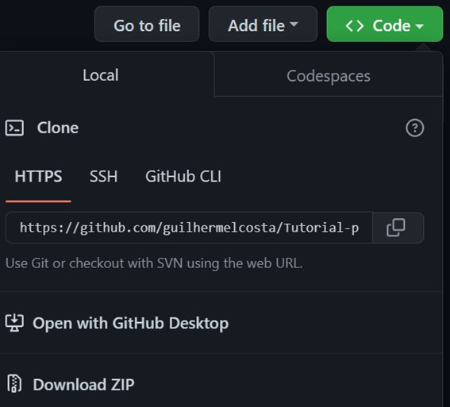

   - O exemplo de uso na prática ficaria assim: `git remote add origin https://github.com/guilhermelcosta/Tutorial-Git.git`.

Quase pronto! Seus repositórios já estão interligados, o que falta agora é apenas "transferir" os arquivos locais para o repositório remoto, usando o comando `push`.

## _II.4 Realizando o primeiro push dos seus arquivos para o repositório_

Insira no terminal a seguinte linha de código: `git push -u origin main`. O que esse comando quer dizer é que estamos dando um push de arquivos da nossa branch `main` na nossa `origin` (GitHub).

- _Observação: no código referido acima, o `-u` é colocado estritamente apenas no **primeiro push**, não sendo necessário nos demais._

Pronto, apenas! Feito isso, basta recarregar seu navegador, que os arquivos já estarão sincronizados.

Além disso, lembre-se que caso você adione, delete ou altere qualquer arquivo em seu repositório local, basta usar os seguintes comandos para dar o push deles:

```
git add <arquivos ou .>

git commit -m <mensagem>

git push origin <nome da branch>
```

### III. Pull do GitHub para o computador

Agora que você já sabe como transferir os seus arquivos locais para seu repositório local, vou te mostrar como fazer o contrário. Ou seja, como baixar os arquivos remotos para seu repositório local.

### _III.1 Realizar fetch dos arquivos remotos_

Vamos supor que você está trabalhando em um projeto junto com outros colaboradores, e que, por algum motivo, alguém faça uma mudança no repositório **remoto** do projeto. Para que nós não corramos o risco de que existam dois repositórios de uma mesma branch **diferentes**, nós precisamos verificar se os arquivos em nossa máquina são os mesmos que estão remotos.

Para simular essa situação, eu vou fazer uma modificação no repositório remoto que criei no tópico [II.2](#ii2-criando-um-repositório-remoto). Na imagem abaixo, veja que inseri a linha 3 no meu README a frase "Fiz essa modificação pelo repositório remoto", e cliquei em `Commit changes` em seguida, logo abaixo.

   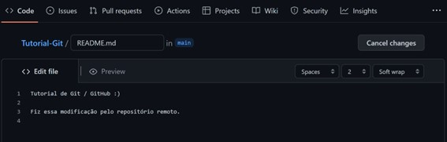

   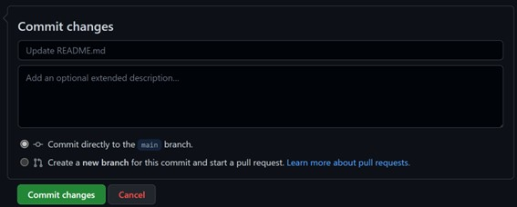

- O que eu fiz aqui, é basicamente a mesma coisa que mostrei no primeiro capítulo. Fiz uma alteração e fiz o seu commit, mas dessa vez já no repositório remoto do GitHub.

Primeiro vamos procurar em nosso repositório remoto, quais foram as modificações que foram feitas. Para isso, vamos utilizar o comando `git fetch`.

### _III.2 Comparando o arquivo local com o remoto_

Logo em seguida, vamos verificar qual é a diferença entre os arquivos em nosso PC (repositório local) e os que estão remotos. Para fazer isso, vamos usar o seguinte código:

- `git log HEAD..origin/<nome da branch>` &rarr; Exemplo prático: `git log HEAD..origin/main`.

No caso do exemplo, o terminal irá nos retornar a seguinte mensagem:

   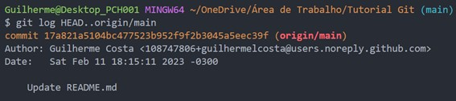

Conforme pode ser verificado, o terminal nos informa que houve uma modicação no arquivo `README.md`.

### _III.3 Baixando os arquivos remotos para o repositório local_

Agora que já conferimos as alterações realizadas, para baixar elas para o nosso repositório local, basta usar o comando `git pull` e pronto! todas os seus arquivos já serão atualizados.

   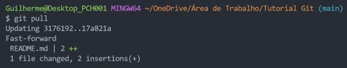

### IV. Criação de diferentes branchs

Até o momento, a nossa única branch é a `main`. No entanto, vamos supor que você esteja desenvolvendo uma nova funcionalidade e, por algum motivo, o seu código foi prejudicado por isso. Como prevenir que essas mudanças "estraguem" um código que já estava consolidado? simples, com o uso de branchs diferentes.

Para criar a nova branch, basta usar o comando `git branch <nome da branch>`. Para fins de teste, eu criei a branch `teste-branch` no nosso repositório. Em seguida, para conferirmos se essa branch realmente foi criada, use o comando `git branch`, que irá listas todas as branchs atuais do repositório.

   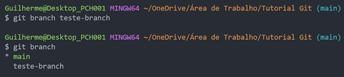

Veja que a branch `main` está destacada em verde, pois é a nossa branch que estamos trabalhando no momento, e a branch `teste-branch` abaixo dela.

### _IV.1 Alterar entre branchs diferentes_

Para alterar entre as branchs, use o comando `git checkout <nome da branch>`. No nosso exemplo, seria `git checkout teste-branch`.

   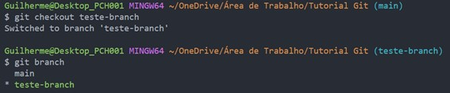

### _IV.2 Interface GitHub para visualização de branchs_

Para visualizar melhor a questão das branchs, eu fiz uma alteração no arquivo `README.md`, no qual adicionei na linha 5 a seguinte frase: "Essa modificação foi feita na branch `teste-branch`". Seguindo o mesmo passo a passo da primeira sessão do tutorial, vou dar o push nessas alterações que fiz, utilizando os comandos `git add .`, `git commit -m "feat: adicionada teste-branch"` e `git push origin teste-branch`.

Em seu repositório remoto do GitHub, observe agora que na parte superior, ao lado de `main`, vai estar indicado que existem duas branchs. Conforme ilustrado abaixo.

   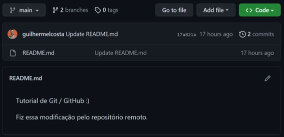

Para alternar entre elas, clique no botão de `main` e selecione a outra branch que deseja visualizar.

   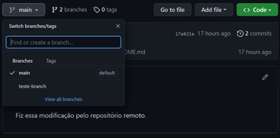

No caso do exemplo acima, note que após alterar para a branch `teste-branch`, o `README.me` é alterado para a sua nova versão, que possui a linha adicional que eu escrevi (Compare a primeira figura com a abaixo). Essa linha existe apenas na branch `teste-branch`, e não na `main`.

   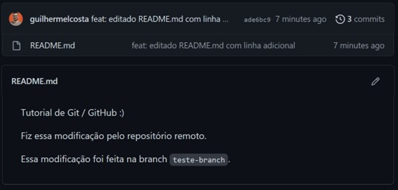

### V. Unir conteúdo de duas branchs diferentes

Para unir duas branchs diferentes, use o comando `git merge <nome da branch>`. Lembre-se, você ira juntar a branch indicada no código na branch que você está usando no momento. Ou seja, se eu quero juntar o conteúdo de `teste-branch` em `main`, eu preciso estar com a branch `main` ativa, e utilizar o comando `git merge teste-branch`, por exemplo.

### VI. Clonando um repositório remoto para o seu computador

Utilize o comando `git clone <link do repositório>` para clonar um respotiório remoto para o seu computador. Eu ensinei onde conseguir o link do repositório no tópico II.3.

### VII. Fechamento e lista de comandos Git

Eu mostrei como você pode criar um repositório do zero neste tutorial. No entanto, não foram mostrados todos os comandos do Git, uma vez que alguns deles podem ser bastante específicos na maioria das vezes. Como ninguem é obrigado a decorar nada, deixo aqui um link com a [lista dos comandos Git](https://www.atlassian.com/git/tutorials/atlassian-git-cheatsheet), elaborado pela Atlassian.
